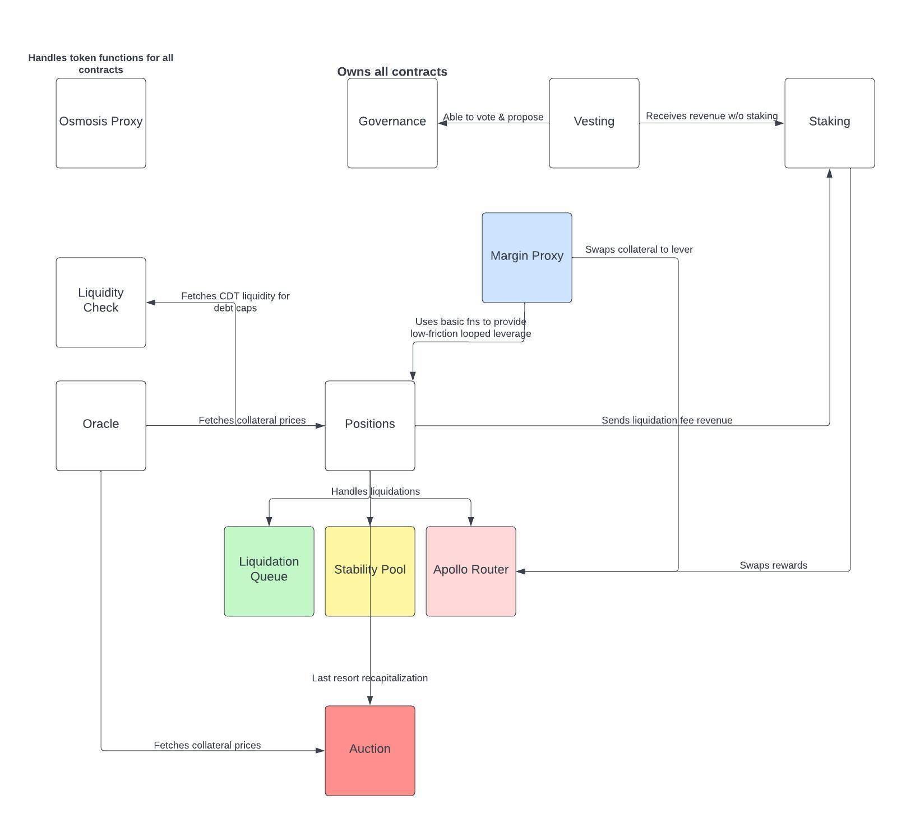

# Membrane Contracts

Auomated mixed-asset debt market protocol powered by smart contracts on [Osmosis](https://osmosis.zone).

## Core CDP Contracts

| Name                                                       | Description                                  |
| ---------------------------------------------------------- | -------------------------------------------- |
| [`positions`](contracts/cdp)                               | Credit position manager                      |
| [`liquidation queue`](contracts/liq-queue)                   | Debt liquidation queue                       |
| [`stability pool`](contracts/stability-pool)               | Position stability pool                      |
| [`debt auction`](contracts/debt_auction)                   | Last-resort MBRN auction for bad debt        |
| [`oracle`](contracts/oracle)                               | TWAP oracles for approved assets             |
| [`liquidity check`](contracts/liquidity_check)             | Checks for acceptable AMM liquidity of collateral assets ‎ ‎  ‎ ‎ ‎ ‎ ‎ ‎ ‎ ‎ ‎ ‎ ‎ ‎ ‎ ‎ ‎ ‎ ‎ ‎ ‎ ‎ ‎ ‎ ‎ ‎ ‎ ‎ ‎‎ ‎ ‎ ‎ ‎ ‎ ‎ ‎ ‎ ‎ ‎ ‎ ‎ |

## Governance Contracts

| Name                                                       | Description                                  |
| ---------------------------------------------------------- | -------------------------------------------- |
| [`governance`](contracts/governance)                       | Decentralized governance contract for updating protocol params and contract versions |
| [`staking`](contracts/staking)                             | Manages staked MBRN functionality            |
| [`vesting`](contracts/vesting)                             | Manages vesting MBRN functionality           |

## Periphery Contracts

| Name                                                       | Description                                  |
| ---------------------------------------------------------- | -------------------------------------------- |
| [`osmosis proxy`](contracts/osmosis-proxy)                 | Proxy to Osmosis SDK module functions        |
| [`margin proxy`](contracts/margin-proxy)                   | Proxy for cleaner looped margin functionality    ‎ ‎  ‎ ‎ ‎ ‎ ‎ ‎ ‎ ‎ ‎ ‎ ‎ ‎ ‎ ‎ ‎ ‎ ‎ ‎ ‎ ‎ ‎ ‎ ‎ ‎ ‎ ‎ ‎‎ ‎ ‎ ‎ ‎ ‎ ‎ ‎ ‎ ‎ ‎ ‎ ‎  ‎ ‎  ‎ ‎ ‎ ‎ ‎ ‎ ‎ ‎ ‎ ‎ ‎ ‎ ‎ ‎ ‎ ‎ ‎ ‎ ‎  |

## Docs
[Documentation](https://membrane-finance.gitbook.io/membrane-docs/)

